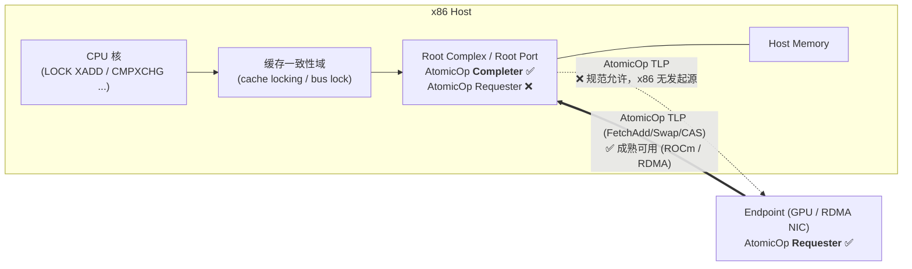
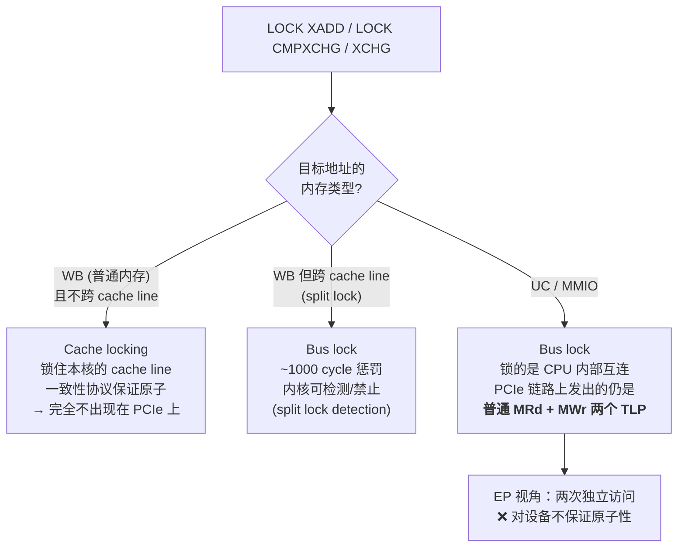
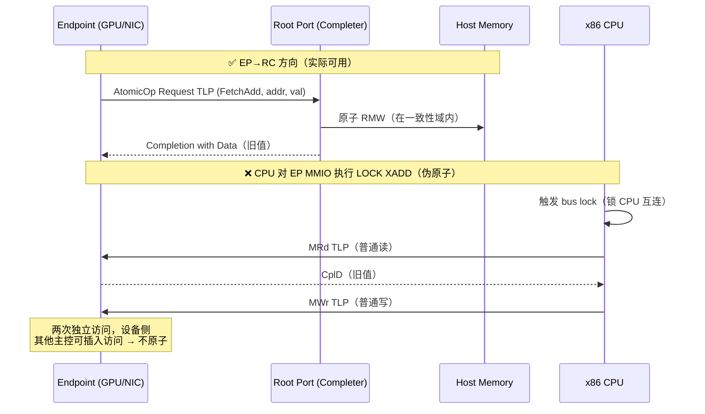
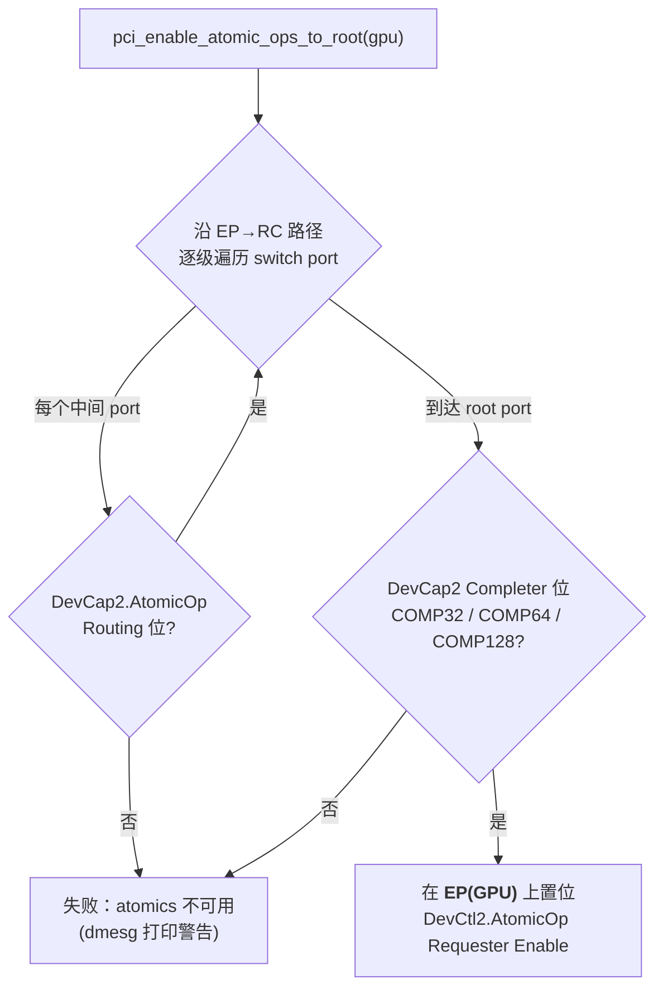
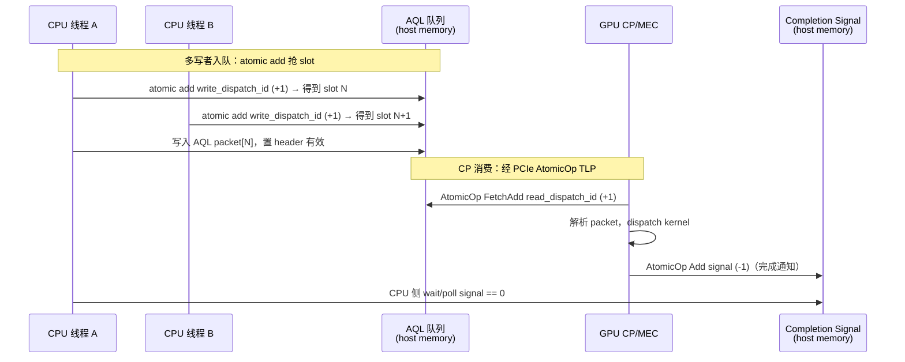

# x86 平台与 PCIe AtomicOp：CPU/RC 能否向 EP 发出 Atomic Request TLP？

> 结论先行：**不能。** x86 CPU 没有指令路径生成 AtomicOp Request TLP；x86 的 Root
> Complex 只实现 AtomicOp **Completer**（和部分 Routing）能力，不实现 Requester。
> PCIe atomic 在 x86 平台上是单向成熟的：**EP → RC 可用，RC → EP 实践中不存在**。

---

## 1. 背景：PCIe AtomicOp 是什么

PCIe 3.0（由 Atomic Operations ECN 引入）定义了三种原子读-改-写请求 TLP：

| 操作 | 操作数宽度 | 语义 |
|------|-----------|------|
| FetchAdd | 32 / 64 bit | 取出旧值并加上操作数 |
| Swap | 32 / 64 bit | 无条件交换 |
| CAS (Compare and Swap) | 32 / 64 / 128 bit | 比较相等则交换 |

参与角色：

- **Requester**：发起 AtomicOp 请求的一方（需置位 `DevCtl2.AtomicOp Requester Enable`）
- **Completer**：在目标地址上原子地执行 RMW 并返回旧值的一方（能力位在 `DevCap2`）
- **Routing**：Switch/Root Port 转发 AtomicOp 的能力（能力位在 `DevCap2`）

```
DevCap2 寄存器中的相关能力位（lspci -vvv 可见）：
    AtomicOpsCap: Routing±  32bit±  64bit±  128bitCAS±
                  ^routing  ^------ Completer 能力 ------^

注意：DevCap2 中只有 Completer 和 Routing 的能力位，
     规范没有为 "Requester capability" 定义能力位，
     只有 DevCtl2 中的 Requester Enable 控制位。
```

## 2. 方向性：x86 平台上谁能向谁发 Atomic



- **EP → RC（device-to-host）**：✅ 这是 PCIe atomic 在 x86 上唯一实际使用的方向。
  GPU（ROCm）、RDMA 网卡（atomic verb offload）对 host memory 做原子操作都走这条路。
  Intel 自 Haswell/Broadwell、AMD 自 Zen 起 root port 普遍支持 32/64-bit Completer。
- **RC → EP（host-to-device）**：❌ 规范允许 Root Port 做 Requester，但 x86 ISA 没有
  任何指令能表达"对这个 MMIO 地址发一个 PCIe FetchAdd"，RC 没有发起源。
- **EP ↔ EP（P2P）**：取决于路径上所有 port 的 Routing 能力位。

## 3. 为什么 CPU 发不出来：x86 LOCK 指令的真实行为

x86 原子指令的原子性是在**缓存一致性域内**实现的，从不翻译成 AtomicOp TLP：



关键点（Linux 内核文档 `Documentation/x86/buslock.rst` 原文）：

> "A bus lock is acquired through either split locked access to writeback (WB)
> memory or **any locked access to non-WB memory**."

也就是说，`LOCK` 指令打到 UC/MMIO 地址会触发 bus lock，但 bus lock 锁的是 CPU
这一侧的互连；PCIe 协议中没有对应的锁语义（PCI 时代的 LOCK#/PCIe 的 MRdLk 仅为
legacy 遗留且已废弃），EP 看到的只是普通的读 TLP + 写 TLP。

### 时序对比



## 4. 证据链

### 4.1 Intel 官方回复（最直接）

Intel Community 提问 *"If Intel Xeon Processor Scalable Family support PCIe
AtomicOps host-to-device transactions?"*（明确问 host→device、x86 ISA 指令发起）：

> Intel 回复：**Xeon Scalable 不支持 host→device 的 AtomicOps**；
> 前代 Xeon 也只支持 device→host 方向（RC 仅作 Completer）。

来源：<https://community.intel.com/t5/Server-Products/If-Intel-Xeon-Processor-Scalable-Family-support-PCIe-AtomicOps/td-p/587536>

### 4.2 AMD ROCm 官方文档（实际使用方向）

> "These atomic operations are **initiated by the I/O devices**…"

ROCm 要求 "CPU 支持 PCIe atomics"，指的是 RC 的 **Completer** 能力。
来源：<https://instinct.docs.amd.com/projects/amdgpu-docs/en/latest/conceptual/pcie-atomics.html>

### 4.3 Linux 内核代码（检查方向写在函数名里）

为 amdgpu 引入的 API 是 `pci_enable_atomic_ops_to_root()` —— **to root**：



注意 Requester Enable 设置在 **EP** 上，root port 上检查的只有 **Completer** 位。
内核中不存在"使能 RC 作为 Requester 向 EP 发 atomic"的代码路径。

- 补丁：<https://lists.freedesktop.org/archives/amd-gfx/2017-December/016840.html>
- QEMU 为虚拟化补的同样只是 root port 的 **completion** 能力上报：
  <https://lists.nongnu.org/archive/html/qemu-devel/2023-04/msg03264.html>
- 实际故障案例（root port 不报 Completer → ROCm atomics 不可用）：
  <https://github.com/RadeonOpenCompute/ROCm/issues/2429>

### 4.4 x86 bus lock 行为

- Linux 内核文档：<https://www.kernel.org/doc/Documentation/x86/buslock.rst>
- split lock / bus lock 实测（~1000 cycle 惩罚）：
  <https://rigtorp.se/split-locks/>、
  <https://chipsandcheese.com/p/investigating-split-locks-on-x86>

## 5. 如何在自己机器上验证

```bash
# 需要 root 读 PCIe 扩展配置空间
sudo lspci -vvv | grep -iE '^[0-9a-f]+:|AtomicOps' | grep -B1 -i atomic
```

典型输出（root port）：

```
00:01.0 PCI bridge: Intel Corporation ... (Root Port)
   DevCap2: ... AtomicOpsCap: Routing- 32bit+ 64bit+ 128bitCAS+
   DevCtl2: ... AtomicOpsCtl: ReqEn- EgressBlck-
```

解读：`32bit+ 64bit+` 表示该 root port 可作 Completer 接收 EP 发来的 atomic；
没有任何位表示"RC 可以作为 Requester 向下游发 atomic"——规范里就没有这个能力位，
而 x86 平台也没有把 CPU 指令翻译成 AtomicOp TLP 的机制。

## 6. AMD GPU 中 CP 的 Atomic 包：谁在用、用在哪

前面说了 EP → RC 方向的 PCIe atomic 是实际可用的，那 GPU 侧是谁在发起？
AMD GPU 上有两个发起源：

1. **Shader（CU）的原子指令** —— 应用 kernel 代码，经 GL2/TC 发出；
2. **CP（Command Processor）解析的 atomic 命令包** —— PM4 的 `ATOMIC_MEM`
   包（SDMA 引擎也有对应的 atomic 包），由固件/驱动/运行时使用。

CP 包括 gfx 流水线的 PFP/ME 和 compute 的 MEC（以及新架构的 MES）。
本节讨论第二种：CP atomic 包的使用场景。

### 6.1 核心场景：AQL 用户态队列管理

这是 ROCm 官方文档明确列出的三个 atomic 用法（原文引自
[How ROCm uses PCIe atomics](https://rocm.docs.amd.com/en/docs-6.3.2/conceptual/pcie-atomics.html)）：

| 对象 | 谁执行 | 操作 | 原文 |
|------|--------|------|------|
| `read_dispatch_id` | GPU 的 CP（MEC） | 64-bit atomic add | "The command processor on the GPU agent uses a 64-bit atomic add operation" |
| `write_dispatch_id` | CPU 和 GPU 双方 | 64-bit atomic add | "The CPU and GPU agents use a 64-bit atomic add operation. It supports multi-writer queue insertions" |
| HSA Signal | CPU 和 GPU 双方 | 64-bit atomic | "A 64-bit atomic operation is used for CPU & GPU synchronization" |



关键闭环：AQL 队列结构（rptr/wptr/signal）通常放在 **host memory** 里，
CP 对它们做 atomic 时发出的就是本文前半部分讨论的 **EP → RC 方向的
PCIe AtomicOp TLP** —— 这正是 ROCm 要求 root complex 支持 atomic
Completer 的直接原因。

### 6.2 HSA Signal / Barrier 包

kernel dispatch 完成后由 CP 对 completion signal 做 atomic 递减；AQL 的
Barrier-AND / Barrier-OR packet 也由 CP 解析，等待一组 signal 满足条件后
才放行后续 packet。

### 6.3 队列间 / 引擎间 / 多卡同步（semaphore）

`ATOMIC_MEM` 包支持 **loop 模式**（带 poll interval）：CP 反复执行 CAS
直到成功才继续解析后面的包。这使得 gfx / compute / SDMA ring 之间，甚至
多 GPU 之间（XGMI / PCIe P2P），可以在不惊动 CPU 的情况下完成
semaphore acquire/release：producer 队列用 atomic add 释放，consumer
队列用 loop-CAS 获取。

### 6.4 驱动层计数器 / fence 类更新

Mesa（radeonsi/radv）和内核驱动在需要"在命令流的精确位置原子地修改一个
内存值"时使用 CP atomic 包（查询结果累加、fence/timeline 值更新等），
避免为一次 RMW 发射整个 wavefront。

### 6.5 TLP 视角：哪些操作真正需要 Atomic TLP

把 HSA 队列协议的每类操作按 TLP 拆开看，会发现一个清晰的设计模式：
**所有需要原子 RMW 的共享数据结构都放在 host memory 侧**，使协议永远
不需要 host→EP 方向的 atomic（正好绕开 x86 RC 的能力限制）：

| 数据结构 | 位置 | CPU 侧访问 | GPU 侧访问（TLP） | 需要 Atomic TLP？ |
|---|---|---|---|---|
| `write_dispatch_id`（写指针） | host memory | 缓存内 `LOCK XADD`（不出 PCIe） | AtomicOp FetchAdd（device-side enqueue 时） | ✅ 多写者，必须 |
| `read_dispatch_id`（读指针） | host memory | 普通读 | AtomicOp FetchAdd | ✅ |
| HSA Signal | host memory | 缓存内原子指令 + wait | AtomicOp Add/CAS | ✅ CPU/GPU 双方 RMW |
| fence 序号（amdgpu 内核 fence） | host memory (GTT) | 普通读（poll/中断） | **普通 MWr**（RELEASE_MEM 写值） | ❌ 单写者，普通写即可 |
| doorbell | **EP 侧（BAR）** | **普通 MWr**（posted write） | — | ❌ |

两个关键设计点：

1. **唯一的 host→EP 写是 doorbell，而 doorbell 被刻意设计成不需要原子性。**
   它只是"踢一脚"的通知，权威状态（`write_dispatch_id`）在 host memory 里。
   即使 doorbell 写丢序、重复、与其他线程交错，CP 醒来后去 host memory
   原子地读真实指针，结果都正确。这就是"RMW 留在 host 侧、对 EP 只做
   幂等 posted write"的协议手法。

2. **不是所有 GPU→host 同步都用 atomic TLP。** fence 这种单写者-单读者
   的值，GPU 普通 MWr 写、CPU 普通读即可（顺序由 RELEASE_MEM 的
   flush/写序保证）。Atomic TLP 只用在真正需要 RMW 语义处：多写者抢
   slot（FetchAdd）、signal 递减、semaphore CAS。

边界情况：若把 signal/队列放在 **GPU VRAM**（设备本地同步，省一次跨
PCIe），GPU 自身访问没问题，但 CPU 无法对其原子操作（`LOCK` 打到 BAR
的 UC/WC 地址不产生原子语义，见第 3 节）。因此 ROCm 中凡是
**system-scope**（CPU 参与）的 signal 必须放 host 的 fine-grained
memory，**device-scope** 的才可放 VRAM —— 内存放置规则本身就是这个
方向性限制的影子。

### 6.6 为什么用 CP atomic 而不是 shader atomic

| | CP atomic 包 | Shader (CU) atomic 指令 |
|---|---|---|
| 执行点 | 命令流中的精确位置，与前后包天然有序 | wave 调度时机不确定 |
| 开销 | 无需启动 wavefront，固件直接发 | 要 dispatch + wave launch |
| 阻塞等待 | 支持 loop-CAS（队列级自旋） | wave 自旋会占住 CU |
| 使用者 | 固件（MEC/MES）、KMD、UMD 运行时 | 应用 kernel 代码 |

一句话总结：**CP 的 atomic 包是 HSA 用户态队列模型的基础设施** ——
多写者入队、读指针推进、completion signal、队列间 semaphore 都靠它；
当这些数据结构位于 host memory 时，它就是 GPU 上 PCIe AtomicOp TLP
的主要发起源之一。

## 7. 需要 host→device 原子语义怎么办

| 方案 | 说明 |
|------|------|
| Doorbell + 设备侧处理 | host 只写 doorbell，原子性由设备内部固件/硬件保证。NVMe、网卡的标准做法。 |
| 设备侧轮询命令队列 | host 把操作描述符写入内存队列，设备 DMA 取走后在设备内原子执行。 |
| CXL.cache | 设备内存纳入 CPU 一致性域，`LOCK` 指令直接有效。这是从根本上解决该需求的路线。 |

---

*整理日期：2026-06-11*
