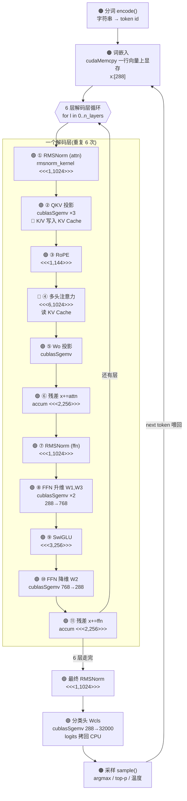

# llama2.cu · Transformer 推理全流程详解

> 基于 `~/llama2.cu/run.cu` 的真实代码,逐阶段拆解 Transformer 推理:**每一步对应哪段代码、怎么丢给 GPU 算(grid/block 怎么分)、数据形状如何流动**。
> 配置示例取自实测的 `stories15M.bin`:`dim=288, n_layers=6, n_heads=6, head_size=48, hidden_dim=768, vocab=32000, seq_len=256, dtype=fp32`。

---

## 0. 一句话概括

推理是**自回归**的:每次只喂 1 个 token,过 6 个解码层算出词表上 32000 个分数(logits),采样出下一个 token,再喂回去循环。

```
prompt ──分词──▶ [token] ──forward()──▶ [32000 logits] ──采样──▶ next token ──┐
   ▲                                                                          │
   └──────────────────────────── 喂回去,循环 ◀──────────────────────────────┘
```

整个 `forward()` 只反复用 **6 类 GPU 操作**:RMSNorm、MatMul(cuBLAS)、RoPE、Attention、SwiGLU、残差相加。

---

## 1. 三种"算"的颜色(贯穿全文)

| 标记 | 含义 | 在 run.cu 里 |
|------|------|-------------|
| 🟠 **CPU** | 主机上执行 | 分词 `encode()`、采样 `sample()`、循环控制 |
| 🟣 **cuBLAS** | 调库做矩阵乘 | 所有线性层 → `cublasSgemv` |
| 🟢 **kernel** | 自写 CUDA kernel | RMSNorm / RoPE / Attention / SwiGLU / 残差 |
| 🌸 **KV Cache** | 显存里的历史 K/V | 注意力读写 |

> **核心取舍**:这个项目只有"矩阵乘"调库,其余算子全部手写且**一个操作一个独立 kernel**。这让代码极好读,但每步都有 kernel 启动 + 显存往返开销。你的 `~/infer` 项目反过来——把多个算子**融合成一个 kernel**,难读但极快。

---

## 2. 完整流水线(Mermaid 流程图)



> 如果你的渲染器不支持 Mermaid,下面的 ASCII 版表达同样信息。

---

## 3. 流水线(ASCII 版 + 形状)

```
┌─────────────────────────────────────────────────────────────────────┐
│  🟠 分词         "Once upon"  ─encode()─▶  [1, 9038, 2501, ...]        │
├─────────────────────────────────────────────────────────────────────┤
│  🟠 词嵌入       token ──cudaMemcpy──▶  x:[288]  (上显存,常驻)         │
└─────────────────────────────────────────────────────────────────────┘
                                │
        ╔═══════════════════════▼════════════════════════╗
        ║          解码层 × 6  (x 始终 [288])             ║
        ║                                                 ║
        ║  ① RMSNorm        x  ─▶ xb:[288]      🟢        ║
        ║  ② QKV 投影       xb ─▶ q,k,v:[288]   🟣 →🌸KV  ║
        ║  ③ RoPE           q,k 原地旋转         🟢        ║
        ║  ④ 注意力         q,KV ─▶ xb:[288]    🌸        ║
        ║  ⑤ Wo 投影        xb ─▶ xb2:[288]     🟣        ║
        ║  ⑥ 残差           x += xb2            🟢        ║
        ║  ⑦ RMSNorm        x  ─▶ xb:[288]      🟢        ║
        ║  ⑧ FFN 升维       xb ─▶ hb,hb2:[768]  🟣        ║  ← 唯一升维处
        ║  ⑨ SwiGLU         silu(hb)·hb2:[768]  🟢        ║
        ║  ⑩ FFN 降维       hb ─▶ xb:[288]      🟣        ║
        ║  ⑪ 残差           x += xb  ──┐        🟢        ║
        ╚══════════════════════════════│══════════════════╝
                          回到 ① ◀─────┘ (还有层) / 跳出 (6 层完)
                                │
┌───────────────────────────────▼───────────────────────────────────────┐
│  🟢 最终 RMSNorm   x:[288]                                              │
│  🟣 分类头 Wcls    x:[288] ──▶ logits:[32000]  ──cudaMemcpy回CPU──▶     │
│  🟠 采样           logits ──▶ next token  ──喂回开头──▶ 循环            │
└─────────────────────────────────────────────────────────────────────────┘
```

**形状要点**:主干维度始终 `288`;只有 FFN 内部临时升到 `768` 再降回。层与层之间数据**全程不离开显存**,只有开头(嵌入)和结尾(logits)各一次主机↔设备拷贝。

---

## 4. 逐阶段详解(概念 / 代码 / GPU 调度)

每个阶段三件事:**它在数学上干什么** → **run.cu 哪段代码** → **怎么调度到 GPU**。

---

### 🟠 阶段 A — 分词 Tokenize

| | |
|--|--|
| **概念** | Transformer 只认整数。BPE 分词器把字符串切成子词、查表得 id,开头补 BOS(=1)。 |
| **位置** | `generate()` |
| **调度** | CPU,贪心 BPE 合并 |

```c
int* prompt_tokens = malloc(...);
encode(tokenizer, prompt, 1/*BOS*/, 0, prompt_tokens, &num_prompt_tokens);
int token = prompt_tokens[0];   // 第一个喂进 forward 的 token
```

---

### 🟠 阶段 B — 词嵌入 Embedding

| | |
|--|--|
| **概念** | 用 token id 在嵌入表查出 288 维向量,作为初始隐藏状态 `x`。 |
| **位置** | `forward()` 开头 |
| **调度** | `cudaMemcpy` Host→Device,288 个 float |

```c
float* content_row = w->token_embedding_table + token * dim;
cudaMemcpy(x, content_row, dim*sizeof(float), cudaMemcpyHostToDevice);
```

---

### 🟢 阶段 ① / ⑦ — RMSNorm

| | |
|--|--|
| **概念** | 进注意力/FFN 前归一化。RMSNorm 比 LayerNorm 简单:只按均方根缩放,不减均值。`x̂ = x / √(mean(x²)+ε) · weight` |
| **位置** | `rmsnorm_kernel` (run.cu:301) |
| **调度** | `<<<1, 1024>>>` — **1 个 block、1024 线程协作归约一个向量** |

```c
__global__ void rmsnorm_kernel(float* o, float* x, float* w, int size, int perThread){
    float ss = 0;
    for(...) ss += x[j]*x[j];                  // 每线程累加自己那部分平方和
    ss = BlockReduce(temp).Sum(ss);            // CUB:1024 个部分和 → 1 个总和
    if(threadIdx.x==0) ss = 1.0f/sqrtf(ss/size + 1e-5f);
    __syncthreads();
    for(...) o[j] = w[j] * (ss * x[j]);        // 缩放
}
rmsnorm_kernel <<<1, 1024>>> (o, x, w, size, perThread);
```

**这是"归约型"并行的范例**:块内所有线程先各算一部分,再用 `cub::BlockReduce` 合成全局结果。

---

### 🟣 阶段 ② — QKV 投影

| | |
|--|--|
| **概念** | 三个权重矩阵把 `x̂` 投影成 Query / Key / Value。K、V 同时写入 KV Cache 当前位置。 |
| **位置** | `forward()` + `matmul()` (run.cu:416) |
| **调度** | `cublasSgemv` ×3(矩阵×向量) |

```c
// k,v 指针直接指向 KV Cache 中 pos 处 → 算完即缓存
s->k = s->key_cache   + loff + pos*kv_dim;
s->v = s->value_cache + loff + pos*kv_dim;

matmul(s->q, s->xb, w->wq + l*dim*dim,    dim, dim);
matmul(s->k, s->xb, w->wk + l*dim*kv_dim, dim, kv_dim);
matmul(s->v, s->xb, w->wv + l*dim*kv_dim, dim, kv_dim);

// matmul 内部就是一行 cuBLAS:
void matmul(float* xout, float* x, float* w, int n, int d){
    cublasSgemv(g_cublas_handle, CUBLAS_OP_T, n, d, &alpha, w, n, x, 1, &beta, xout, 1);
}
```

> 权重按行存(d×n),cuBLAS 视角下是 n×d,所以用 `CUBLAS_OP_T` 转置。

---

### 🟢 阶段 ③ — RoPE 旋转位置编码

| | |
|--|--|
| **概念** | Transformer 本身不知词序。RoPE 按位置 `pos` 把 q、k 的每一对分量旋转一个角度(角度随位置和维度变),点积时就自带相对位置信息。 |
| **位置** | `RoPe_rotation_kernel` (run.cu:446) |
| **调度** | `<<<1, dim/2=144>>>` — **每线程旋转一对分量,线程间无依赖** |

```c
__global__ void RoPe_rotation_kernel(int pos, float* sq, float* sk, ...){
    int i = threadIdx.x * 2;                  // 每线程管一对 (i, i+1)
    float freq = 1.0f / powf(10000.0f, (i%head_size)/(float)head_size);
    float fcr = cosf(pos*freq), fci = sinf(pos*freq);
    // [v0,v1] → [v0·cos - v1·sin, v0·sin + v1·cos]
    vec[i]   = v0*fcr - v1*fci;
    vec[i+1] = v0*fci + v1*fcr;
}
RoPe_rotation_kernel <<<1, dim/2>>> (pos, s->q, s->k, ...);
```

---

### 🌸 阶段 ④ — 多头自注意力(核心)

| | |
|--|--|
| **概念** | 当前 q 与缓存里**所有历史 k** 点积得分数 → 缩放 → softmax 成权重 → 对所有历史 v 加权求和。每个头独立。`out = softmax(q·Kᵀ/√head_size)·V` |
| **位置** | `multi_head_attention_kernel` (run.cu:487) |
| **调度** | `<<<n_heads=6, 1024>>>` — **每个 block 一个头,块内 1024 线程协作** |

```c
__global__ void multi_head_attention_kernel(...){
    int h = blockIdx.x;                        // 每个 block 负责一个头
    // 1) 每线程算若干历史位置的 q·k 分数
    for(int t=threadIdx.x; t<=pos; t+=blockDim.x){
        float* k = key_cache + loff + t*kv_dim + (h/kv_mul)*head_size;  // 🌸 读 KV Cache
        float score=0; for(i...) score += q[i]*k[i];
        att[t] = score / sqrtf(head_size);
    }
    __syncthreads();
    softmax_gpu(att, pos+1);                    // 2) 块内 softmax(又一次归约)
    __syncthreads();
    // 3) 每线程算输出的若干维 = Σ att[t]·v[t]
    for(int i=threadIdx.x; i<head_size; i+=blockDim.x){
        float val=0; for(t=0;t<=pos;t++) val += att[t]*v_cache[...][i];
        xb[i] = val;
    }
}
multi_head_attention_kernel <<<n_heads, 1024>>> (...);
```

**线程分工图解**:

```
   block 0 (头0)   block 1 (头1)   ...   block 5 (头5)      ← grid: 6 个头各一块
   ┌──────────┐    ┌──────────┐          ┌──────────┐
   │1024 线程 │    │1024 线程 │   ...    │1024 线程 │      ← 块内协作
   └──────────┘    └──────────┘          └──────────┘
        │
        ├─ 阶段1: 线程 t 算第 t,t+1024,... 个历史位置的 q·k 分数
        ├─ __syncthreads (等所有分数算完)
        ├─ 阶段2: 块内 softmax(归约求 max、求 sum)
        ├─ __syncthreads
        └─ 阶段3: 线程 i 算输出向量第 i 维 = Σ_t att[t]·v[t][i]
```

> 这里出现了**两层并行**:头之间(block 级)+ 头内部时间步/维度(thread 级)。`__syncthreads` 保证分数全部算完才做 softmax。

---

### 🟣 阶段 ⑤ — 注意力输出投影 Wo

```c
matmul(s->xb2, s->xb, w->wo + l*dim*dim, dim, dim);   // cuBLAS, dim→dim
```
把多头拼接结果再过一个线性层映射回 288 维。

---

### 🟢 阶段 ⑥ / ⑪ — 残差连接

| | |
|--|--|
| **概念** | 把子层输出加回输入(skip connection),让信息跨层直通。逐元素加法。 |
| **位置** | `accum_kernel` (run.cu:606) |
| **调度** | `<<<⌈N/256⌉, 256>>>` — **逐元素型并行,一个线程一个元素,无通信** |

```c
__global__ void accum_kernel(float* a, float* b, int n){
    int i = blockIdx.x*blockDim.x + threadIdx.x;
    if(i < n) a[i] += b[i];
}
accum_kernel <<<divUp(dim,256), 256>>> (x, s->xb2, dim);   // 288 → 2 blocks
```

---

### 🟣 阶段 ⑧ — FFN 升维(W1, W3)

```c
matmul(s->hb,  s->xb, w->w1 + l*dim*hidden_dim, dim, hidden_dim);  // 288→768  门控路
matmul(s->hb2, s->xb, w->w3 + l*dim*hidden_dim, dim, hidden_dim);  // 288→768  数据路
```
SwiGLU 前馈有两条并行升维路:W1(门控)和 W3(数据),都升到 768。

---

### 🟢 阶段 ⑨ — SwiGLU 激活

| | |
|--|--|
| **概念** | Llama 的前馈激活:门控路过 SiLU(`x·σ(x)`),再逐元素乘数据路。`h = silu(W1·x̂) ⊙ (W3·x̂)`,表达力比 ReLU 强。 |
| **位置** | `f_silu_elementwise_mul_w3_kernel` (run.cu:578) |
| **调度** | `<<<⌈768/256⌉=3, 256>>>` — 逐元素型 |

```c
__global__ void f_silu_elementwise_mul_w3_kernel(float* hb, float* hb2, int n){
    int i = blockIdx.x*blockDim.x + threadIdx.x;
    if(i < n){
        float val = hb[i];
        val *= 1.0f / (1.0f + expf(-val));   // SiLU = x·sigmoid(x)
        val *= hb2[i];                       // × W3 路
        hb[i] = val;
    }
}
f_silu_elementwise_mul_w3_kernel <<<divUp(hidden_dim,256), 256>>> (s->hb, s->hb2, hidden_dim);
```

---

### 🟣 阶段 ⑩ — FFN 降维 W2

```c
matmul(s->xb, s->hb, w->w2 + l*dim*hidden_dim, hidden_dim, dim);   // cuBLAS, 768→288
```
把 768 维降回主干的 288 维。

---

### 🟢 阶段 C — 最终 RMSNorm

```c
rmsnorm(x, x, w->rms_final_weight, dim);   // 6 层走完后的收尾归一化
```

---

### 🟣 阶段 D — 分类头 Classifier

| | |
|--|--|
| **概念** | 最后一个大矩阵 `wcls` 把 288 维投影到 32000 维——词表里每个词一个分数(logit)。这是最大的一次矩阵乘。 |
| **位置** | `forward()` 末尾 |
| **调度** | `cublasSgemv` 288→32000,然后 `cudaMemcpy` 把 logits 拷回 CPU |

```c
matmul(s->logits_gpu, x, w->wcls, p->dim, p->vocab_size);   // 288 → 32000
cudaMemcpy(s->logits, s->logits_gpu, vocab_size*sizeof(float), cudaMemcpyDeviceToHost);
```

---

### 🟠 阶段 E — 采样 Sample

| | |
|--|--|
| **概念** | 在 CPU 上从 logits 选 token:温度=0 取最大(贪婪);否则除温度→softmax→按概率抽样,可选 top-p 截断。采到的 token 喂回开头。 |
| **位置** | `sample()` (run.cu:1036) |
| **调度** | CPU |

```c
int sample(Sampler* s, float* logits){
    if(s->temperature == 0.0f) return sample_argmax(logits, vocab);   // 贪婪
    for(q...) logits[q] /= s->temperature;                            // 温度缩放
    softmax(logits, vocab);                                           // → 概率
    float coin = random_f32(&s->rng_state);
    return s->topp>0 ? sample_topp(...) : sample_mult(...);           // top-p / 多项式
}
```

---

## 5. GPU 执行模型:`<<<grid, block>>>` 到底什么意思

CPU 端启动 kernel 长这样:`kernel<<<grid, block>>>(args)`。

```
grid  = 启动多少个「线程块 block」     ── 按"有多少独立工作单元"定
block = 每个 block 多少个「线程 thread」── 块内线程可共享内存 + 同步(用于归约)
```

run.cu 全局只用两种 block 大小:

```c
const int num_threads_lrg = 1024;   // 归约型用(rmsnorm/softmax/attention)
const int num_threads_med = 256;    // 逐元素型用(silu/accum)
```

### 两种并行模式

```
┌─ 逐元素型 (silu, accum, rope) ───────────────────────────┐
│  每个线程独立处理一个元素,互不通信                       │
│  grid = ⌈N / 256⌉ ,block = 256                           │
│  [t0][t1][t2]...[tN]   ← 一一对应,简单粗暴               │
└──────────────────────────────────────────────────────────┘

┌─ 归约型 (rmsnorm, softmax, attention) ──────────────────┐
│  一个 block 内 1024 线程"协作"处理一个向量/一个头        │
│  各线程算部分和 → cub::BlockReduce 合成全局 → 再用        │
│  需要 __syncthreads 同步                                  │
└──────────────────────────────────────────────────────────┘

┌─ 矩阵乘 (所有线性层) ────────────────────────────────────┐
│  不自己写 → cublasSgemv。GEMM 想写快极难,库是天花板      │
└──────────────────────────────────────────────────────────┘
```

---

## 6. GPU 调度速查表

> `d=dim=288, h=hidden=768, H=n_heads=6`

| 阶段 | 实现 | Launch 配置 | 线程在做什么 |
|------|------|------------|-------------|
| Embedding 拷贝 | 🟠 cudaMemcpy | H2D, 288 float | 搬一行词向量上显存 |
| RMSNorm | 🟢 rmsnorm_kernel | `<<<1, 1024>>>` | 1024 线程归约平方和再缩放 |
| QKV/O/FFN 投影 | 🟣 cublasSgemv | CUBLAS_OP_T | 矩阵×向量,库内调度 |
| RoPE | 🟢 RoPe_rotation_kernel | `<<<1, 144>>>` | 每线程旋转一对 (q,k) |
| Multi-Head Attn | 🌸 multi_head_attention_kernel | `<<<6, 1024>>>` | 每 block 一头:打分→softmax→加权 |
| 残差相加 | 🟢 accum_kernel | `<<<2, 256>>>` | 逐元素 a[i]+=b[i] |
| SwiGLU | 🟢 f_silu_..._kernel | `<<<3, 256>>>` | 逐元素 silu(w1)·w3 |
| Classifier | 🟣 cublasSgemv | 288→32000 | 投影到词表得 logits |
| Logits 回传 | 🟠 cudaMemcpy | D2H, 32000 float | 搬回主机供采样 |
| 采样 | 🟠 sample() | CPU | 温度/top-p/argmax 选 token |

---

## 7. 关键认知

1. **decoder-only,N 层堆叠**:层数 `n_layers` 从 `.bin` 文件头读出,不写死。stories15M = **6 层**;真 Llama-2-7B = 32 层。①~⑪ 这一套重复 `n_layers` 次。
2. **数据常驻显存**:权重启动时一次性搬上 GPU;激活值层间不回主机;每步只有"嵌入上传"和"logits 回传"两次拷贝。
3. **朴素 = 好读**:每个算子一个独立 kernel。代价是 kernel 启动 + 中间结果显存往返开销。
4. **对比你的 `~/infer`**:后者把 RMSNorm+QKV+RoPE+KVCache 等**融合成一个 kernel**(`rmsnorm_qkv_packed_gemm_rope_kvcache_fusedop`),并上 TMA/MMA,省掉往返、榨干 Hopper——这是"可读" → "极致性能"的演进方向。

---

## 配套

- 交互网页版(可点击展开、动手走形状):`docs/transformer-inference.html`
- 编译运行指南:`BUILD_AND_RUN.md`
- 源码:`run.cu`(forward @623,各 kernel @301–621)
